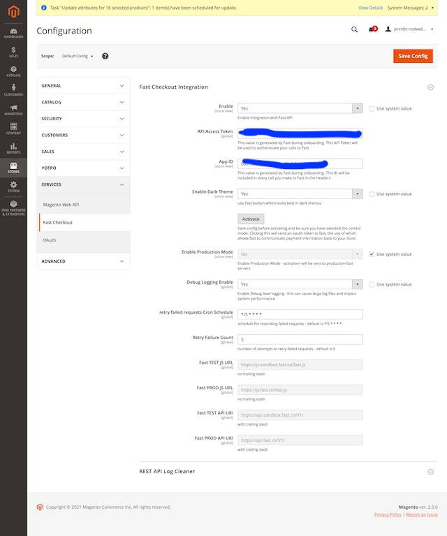

# Installation
using composer, in your magento webroot, issue the following commands: 

```
composer require fast/module-checkout  
php bin/magento module:enable Fast_Checkout
php bin/magento setup:upgrade
php bin/magento setup:di:compile
php bin/magento setup:static-content:deploy
```
 
if for some reason composer is not available, obtain the files from the repo, and place them in app/code/Fast/Checkout and then 
```
php bin/magento module:enable Fast_Checkout
php bin/magento setup:upgrade
php bin/magento setup:di:compile
php bin/magento setup:static-content:deploy
```

# Configuration
1. Navigate to Stores → Configuration
2. Navigate to Services → Fast Checkout



**Enable** - this option allows you to enable the Fast Checkout integration with your Magento store(s). Before enabling the extension, you must fill in the API Access Token and App ID and then authenticate the extension.  
**API Access Token** - is given to you by Fast when setting up account  
**App ID** - is given to you by Fast when setting up account  
**Enable Dark Theme** - use the lighter colored button which looks best on dark themes instead of the traditional fast black button  
**Activate** - click this button to connect your store with FAST API    
**Enable Production Mode** - select Yes, and click Activate button to activate to production FAST; select No, and click Activate button to activate to sandbox FAST.  
**Debug Logging Enable** - use this selector to log all rest API calls on your system. This setting is not recommended in production systems with low resources

1. Enter App ID
2. Enter API Access Token
3. Save Config
3. Activate  
4. Enable = Yes
5. Save Config

# Payment Method
The fast extension will create a new payment method in the magento backend. Orders placed with the fast buttons will show this as their payment method. Customer/Admin placed orders cannot select this payment method.

# Integration
The fast extension will create an integration account for connecting the fast server to the magento store API.  
If you reauthorize this integration, you will need to Activate again.
